# X Recommendation Algorithm Simulator / X 推荐算法模拟器

[English](#english) | [中文](#中文)

---

<a name="english"></a>

## English

A fully interactive web simulator for understanding X's recommendation architecture. This project focuses on **pipeline-level simulation** (not production-level reproduction), aligned with the open-source `home-mixer` flow.

### Background

After deep-diving into the open-source code, we built this simulator to help everyone understand:

- **How candidates flow through stages** — Query Hydration → Sources → Hydrators → Filters → Scorers → Selector → Post-Selection Filters
- **How tweets are filtered** — 10 pre-scoring filters + 2 post-selection filters
- **How tweets are scored** — 18 behavior predictions + 1 continuous dwell-time signal determine ranking
- **How weights affect ranking** — Adjust parameters and see results in real-time

### Screenshots


| Screenshot | Description |
|------------|-------------|
|  | Tweet Analyzer with heat gauge and radar chart |
|  | Ranking Simulator showing pipeline execution |
|  | Weight Laboratory with parameter sliders |

#### Before vs After (UI Redesign, 2026-02-12)

| Page | Before | After |
|------|--------|-------|
| Tweet Analyzer | 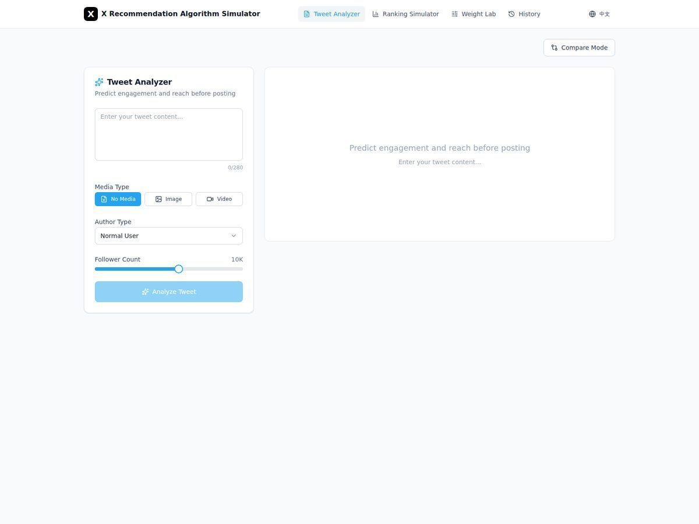 |  |
| Ranking Simulator |  |  |
| Weight Laboratory | 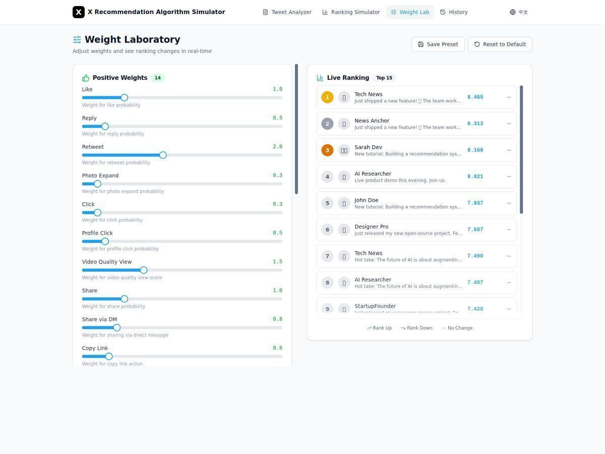 |  |
| History | 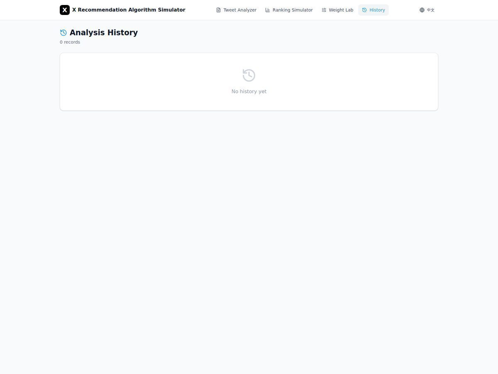 | 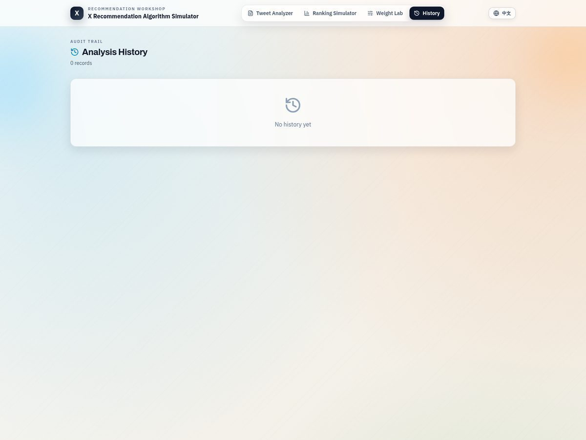 |

### Features

#### Tweet Analyzer
Analyze any tweet content and predict its performance:

- **18 Behavior Predictions** — Likes, retweets, replies, shares, follows, video views, and more
- **Heat Score (0-100)** — Visual gauge showing tweet potential (Low/Medium/High/Viral)
- **Radar Chart** — Visualize 14 positive signals at a glance
- **Optimization Suggestions** — AI-powered tips to improve your tweet
- **Filter Risk Warnings** — Know if your tweet might be filtered out
- **Compare Mode** — Analyze multiple tweets side by side

#### Ranking Simulator
Watch the complete recommendation pipeline in action:

- **Home Mixer-like Stages** — Query Hydrators, Sources, Candidate Hydrators, Pre-Filters, Scorers, Selector, Post-Filters
- **12 Filter Stages** — 10 pre-scoring filters + 2 post-selection filters
- **4 Scoring Stages** — Phoenix ML (simulated) → Weighted Sum → Author Diversity → OON Balance
- **Step-by-Step Animation** — Play, pause, and control the pipeline execution
- **3 Scenarios** — Following Feed (in-network heavy), For You (balanced), Discovery Heavy (out-of-network heavy)
- **Detailed Statistics** — Input/output counts and tweet details at each stage

#### Weight Laboratory
Experiment with ranking parameters in real-time:

- **18+ Weight Sliders** — Adjust all positive and negative signal weights
- **Live Updates** — See ranking changes instantly as you adjust
- **Diversity Controls** — Tune author diversity decay and floor values
- **OON Balance** — Control in-network vs out-of-network content ratio
- **Presets** — Save and load custom weight configurations

### Getting Started

```bash
# Clone the repository
git clone https://github.com/lingengyuan/x-algorithm-simulator.git

# Enter project directory
cd x-algorithm-simulator

# Install dependencies
npm install

# Start development server
npm run dev
```

After starting, open `http://localhost:5173` in your browser.

### Tech Stack

| Category | Technology |
|----------|------------|
| Framework | React 19 + TypeScript |
| Styling | Tailwind CSS 4 |
| Charts | Recharts |
| Animation | Framer Motion |
| Routing | React Router 7 |
| i18n | i18next |
| Icons | Lucide React |
| Build | Vite 7 |

### Project Structure

```
src/
├── core/                    # Core algorithm implementation
│   ├── filters/             # 12 filter implementations
│   ├── scorers/             # 4 scorer implementations
│   ├── pipeline.ts          # Pipeline orchestration
│   └── types.ts             # TypeScript type definitions
├── components/
│   ├── Layout/              # App shell and navigation
│   ├── TweetAnalyzer/       # Tweet analysis module
│   ├── RankingSimulator/    # Ranking visualization
│   ├── WeightLab/           # Weight adjustment module
│   ├── History/             # Analysis history management
│   ├── shared/              # Shared UI components
│   └── ui/                  # Base UI primitives (shadcn/ui)
├── data/
│   ├── mockTweets.ts        # Mock tweet data and scenarios
│   └── defaultWeights.ts    # Default weight configuration
├── hooks/
│   └── useI18n.tsx          # Internationalization hook
├── utils/
│   ├── scoring.ts           # Phoenix score simulation
│   ├── snowflake.ts         # Snowflake ID utilities
│   └── storage.ts           # LocalStorage wrapper
└── App.tsx                  # Main app entry
```

### Algorithm Implementation

#### Filters (12 Stages)

| # | Filter | Description |
|---|--------|-------------|
| 1 | DropDuplicatesFilter | Remove duplicate tweet IDs |
| 2 | CoreDataHydrationFilter | Remove candidates missing required core fields |
| 3 | AgeFilter | Remove tweets older than configured threshold |
| 4 | SelfTweetFilter | Remove user's own tweets |
| 5 | RetweetDeduplicationFilter | Deduplicate reposts of the same original tweet |
| 6 | IneligibleSubscriptionFilter | Remove subscription-only tweets user cannot access |
| 7 | PreviouslySeenPostsFilter | Remove tweets seen by client/bloom history |
| 8 | PreviouslyServedPostsFilter | Remove tweets already served in session (bottom requests) |
| 9 | MutedKeywordFilter | Remove tweets matching muted keywords |
| 10 | AuthorSocialgraphFilter | Remove blocked/muted authors |
| 11 | VFFilter | Post-selection visibility filtering |
| 12 | DedupConversationFilter | Keep highest-scored candidate per conversation |

#### Scorers (4 Stages)

| # | Scorer | Input | Output |
|---|--------|-------|--------|
| 1 | Phoenix ML Scorer | Tweet content & metadata | 18 behavior probabilities |
| 2 | Weighted Sum Scorer | 18 probabilities + weights | Combined weighted score |
| 3 | Author Diversity Scorer | Weighted scores | Decay-penalized scores |
| 4 | OON Balance Scorer | Penalized scores | Final ranking scores |

#### 18 Predicted Behaviors

**Positive Signals (14):**
- Favorite (Like), Reply, Retweet, Quote
- Photo Expand, Click, Profile Click
- Video Quality View, Share, Share via DM, Share via Copy Link
- Dwell, Quoted Click, Follow Author

**Negative Signals (4):**
- Not Interested, Block Author, Mute Author, Report

### Fidelity and Limits

This project intentionally simulates architecture and control flow, not online production behavior.

- **Simulated faithfully (architecture-level):** pipeline stages, filter/scorer ordering, scoring composition, diversity/OON controls, pre/post filtering separation.
- **Approximated locally:** retrieval outputs, Phoenix predictions, user features/query hydration, VF decisions, and all service-backed hydration.
- **Unavailable in open source:** internal `params` values and internal service clients; therefore exact weights/thresholds and score normalization cannot be reproduced 1:1.

### What Can Be Fixed vs. What Cannot Be Fully Reproduced

- **Fixable in this simulator:** stage ordering, filter composition and execution order, scorer combination logic, diversity/OON balancing behavior, deterministic mock data scenarios, and UX-level observability of each pipeline step.
- **Not fully reproducible with open-source only:** online retrieval quality, production feature stores/service outputs, Phoenix model serving details, internal thresholds/normalization in closed `params`, and live anti-abuse/visibility systems.

### Verification Status (2026-02-12)

- `npm run lint` passed
- `npm run build` passed
- Current repository does not define automated unit/E2E test scripts; verification is based on static checks and production build success.

### Language Support

- English
- 中文 (Chinese)

Toggle with the globe icon in the header.

### Related Links

- [X Algorithm Open Source](https://github.com/xai-org/x-algorithm)

### License

MIT

---

<a name="中文"></a>

## 中文

一个完全交互式的 Web 模拟器，帮助理解 X 推荐架构。本项目强调**流程级模拟**，不是线上效果复现，流程结构对齐开源 `home-mixer`。

### 项目背景

在深度阅读开源源码后，我们构建了这个模拟器，帮助大家理解：

- **候选内容如何流转** — Query Hydration → Sources → Hydrators → Filters → Scorers → Selector → Post-Selection Filters
- **推文如何被过滤** — 10 个前置过滤器 + 2 个后置过滤器
- **推文如何被评分** — 18 种行为预测 + 1 个连续停留时长信号共同决定排序
- **权重如何影响排名** — 实时调整参数并查看效果

### 效果截图

| 截图 | 说明 |
|------|------|
| 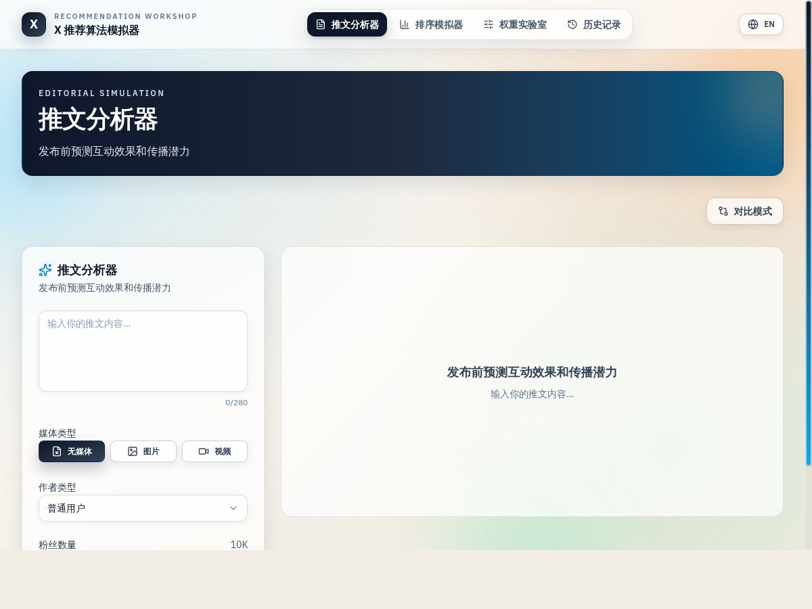 | 推文分析器，包含热度仪表盘和雷达图 |
| 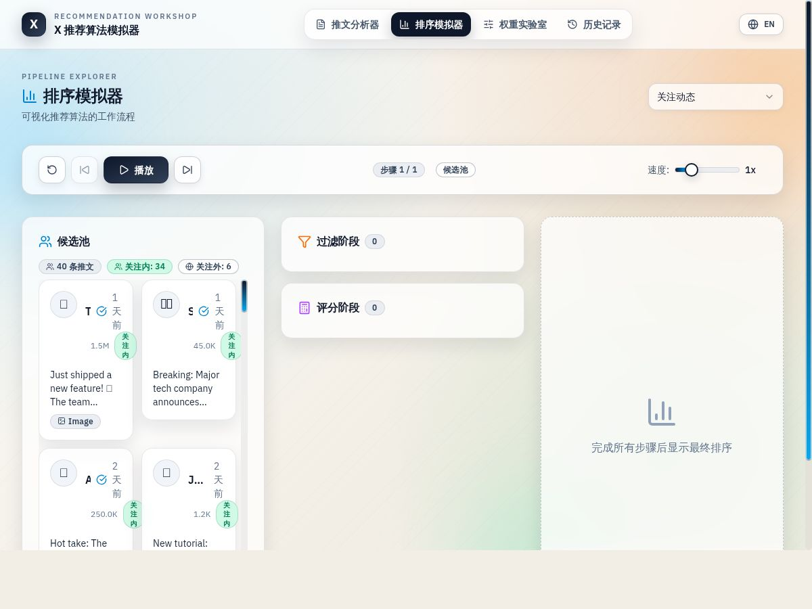 | 排序模拟器，展示管道执行过程 |
| 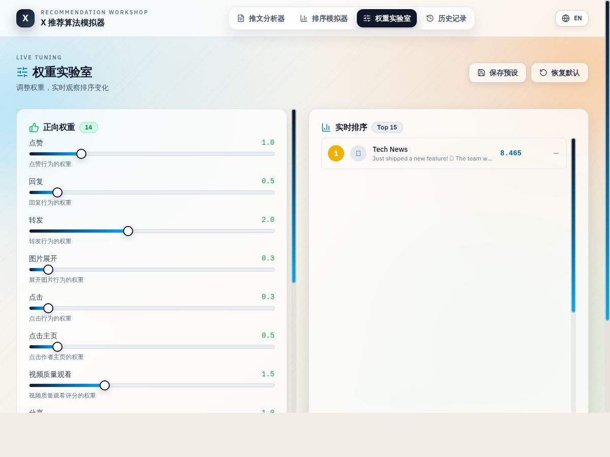 | 权重实验室，包含参数调节滑块 |

#### 前后对比（UI 重设计，2026-02-12）

| 页面 | 重设计前 | 重设计后 |
|------|----------|----------|
| 推文分析器 | 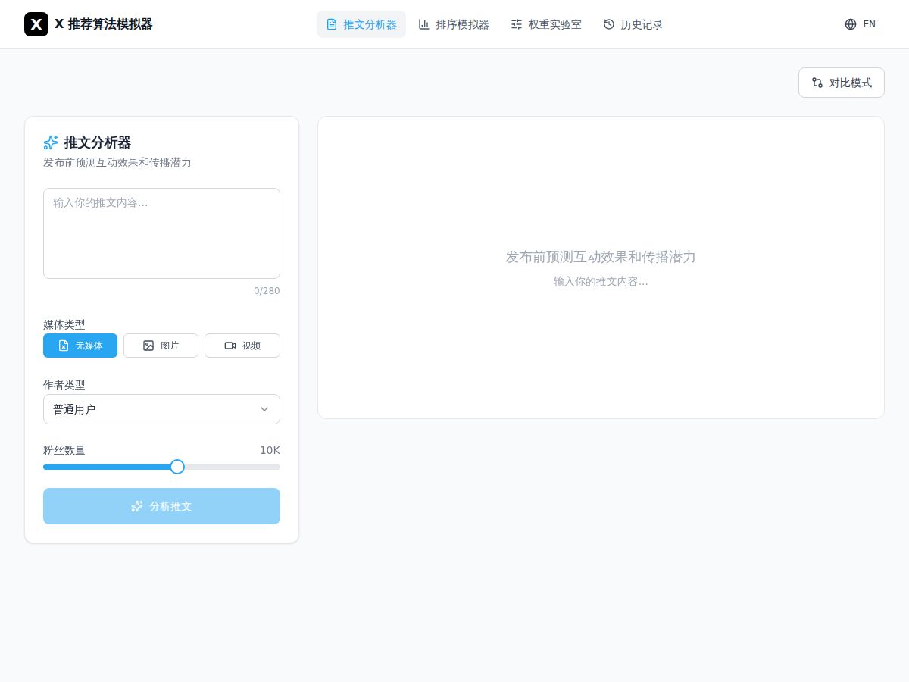 |  |
| 排序模拟器 | 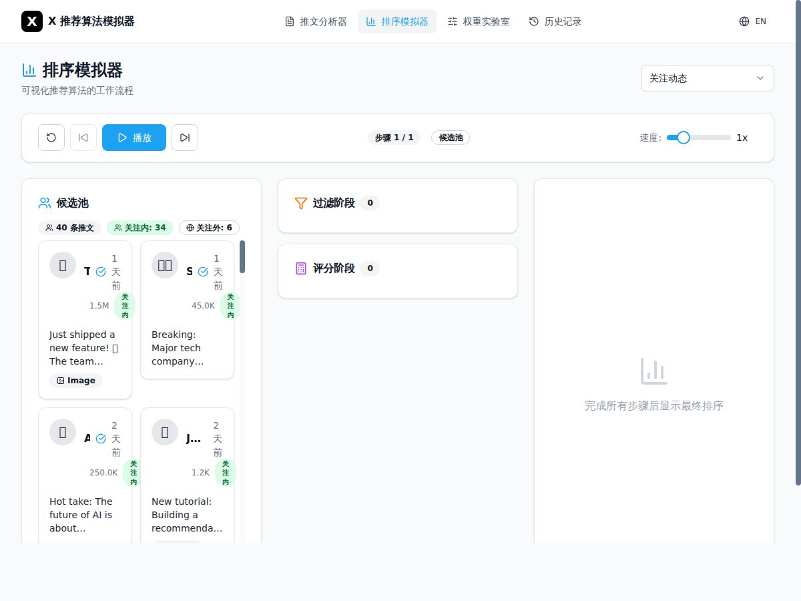 |  |
| 权重实验室 | 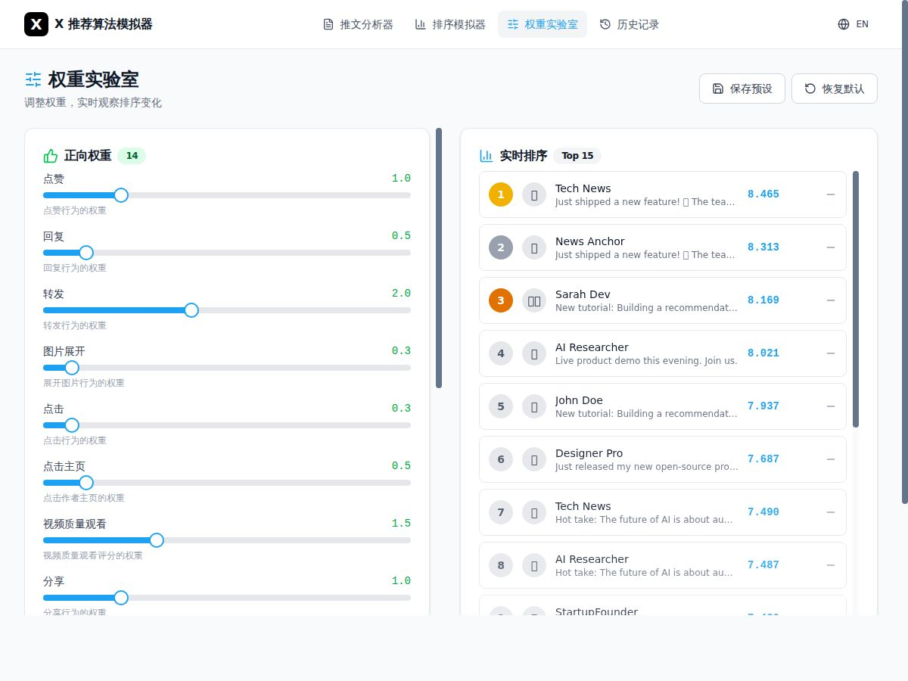 |  |
| 历史记录 | 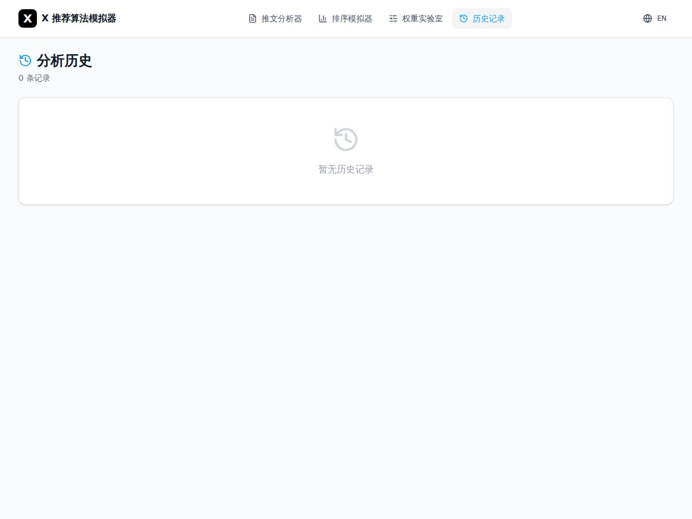 | 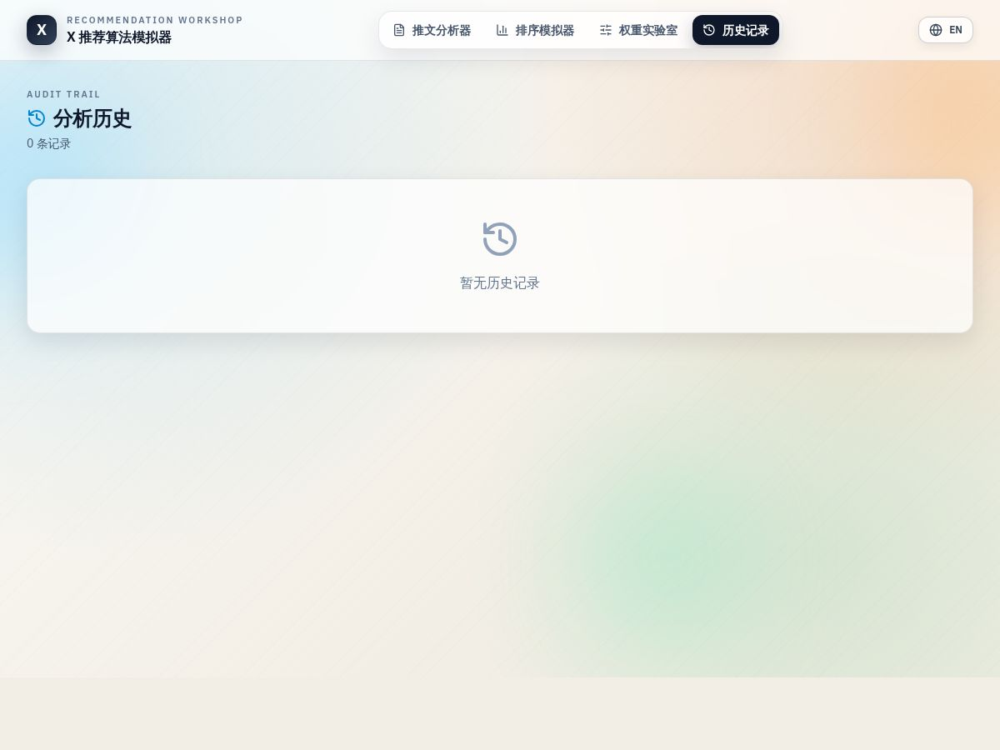 |

### 功能特性

#### 推文分析器

分析任意推文内容，预测其表现：

- **18 种行为预测** — 点赞、转发、回复、分享、关注、视频观看等
- **热度评分 (0-100)** — 可视化仪表盘展示推文潜力（低/中/高/爆款）
- **雷达图** — 一眼看清 14 种正向信号分布
- **优化建议** — AI 驱动的改进提示
- **过滤风险预警** — 提前知道推文是否可能被过滤
- **对比模式** — 多条推文并排分析

#### 排序模拟器

观看完整的推荐管道运行过程：

- **贴近 Home Mixer 的阶段** — Query Hydrator、Source、Candidate Hydrator、前置过滤、评分、选择器、后置过滤
- **12 个过滤阶段** — 10 个前置过滤器 + 2 个后置过滤器
- **4 个评分阶段** — Phoenix ML（模拟）→ 加权求和 → 作者多样性 → 内外网平衡
- **逐步动画** — 播放、暂停、控制管道执行
- **3 种场景** — 关注动态（内网为主）、推荐（内外网平衡）、探索型推荐（外网占比更高）
- **详细统计** — 每个阶段的输入输出数量和推文详情

#### 权重实验室

实时试验排序参数：

- **18+ 权重滑块** — 调整所有正向和负向信号权重
- **实时更新** — 调整参数立即看到排序变化
- **多样性控制** — 调节作者多样性衰减和下限
- **内外网平衡** — 控制关注内容与推荐内容的比例
- **预设保存** — 保存和加载自定义权重配置

### 快速开始

```bash
# 克隆仓库
git clone https://github.com/lingengyuan/x-algorithm-simulator.git

# 进入项目目录
cd x-algorithm-simulator

# 安装依赖
npm install

# 启动开发服务器
npm run dev
```

启动后，在浏览器打开 `http://localhost:5173` 即可使用。

### 技术栈

| 类别 | 技术 |
|------|------|
| 框架 | React 19 + TypeScript |
| 样式 | Tailwind CSS 4 |
| 图表 | Recharts |
| 动画 | Framer Motion |
| 路由 | React Router 7 |
| 国际化 | i18next |
| 图标 | Lucide React |
| 构建 | Vite 7 |

### 项目结构

```
src/
├── core/                    # 核心算法实现
│   ├── filters/             # 12 个过滤器实现
│   ├── scorers/             # 4 个评分器实现
│   ├── pipeline.ts          # 管道编排
│   └── types.ts             # TypeScript 类型定义
├── components/
│   ├── Layout/              # 应用框架和导航
│   ├── TweetAnalyzer/       # 推文分析模块
│   ├── RankingSimulator/    # 排序可视化
│   ├── WeightLab/           # 权重调整模块
│   ├── History/             # 历史记录管理
│   ├── shared/              # 共享 UI 组件
│   └── ui/                  # 基础 UI 原语 (shadcn/ui)
├── data/
│   ├── mockTweets.ts        # 模拟推文数据和场景
│   └── defaultWeights.ts    # 默认权重配置
├── hooks/
│   └── useI18n.tsx          # 国际化 Hook
├── utils/
│   ├── scoring.ts           # Phoenix 评分模拟
│   ├── snowflake.ts         # Snowflake ID 工具
│   └── storage.ts           # LocalStorage 封装
└── App.tsx                  # 主应用入口
```

### 算法实现

#### 过滤器（12 个阶段）

| # | 过滤器 | 说明 |
|---|--------|------|
| 1 | DropDuplicatesFilter | 移除重复推文 ID |
| 2 | CoreDataHydrationFilter | 过滤缺少核心字段的候选 |
| 3 | AgeFilter | 按时效阈值过滤旧推文 |
| 4 | SelfTweetFilter | 移除用户自己的推文 |
| 5 | RetweetDeduplicationFilter | 对同一原文转推进行去重 |
| 6 | IneligibleSubscriptionFilter | 移除用户无订阅资格内容 |
| 7 | PreviouslySeenPostsFilter | 基于 seen/bloom 历史过滤已看内容 |
| 8 | PreviouslyServedPostsFilter | 在 bottom request 中过滤已下发内容 |
| 9 | MutedKeywordFilter | 过滤命中静音关键词的推文 |
| 10 | AuthorSocialgraphFilter | 过滤被屏蔽/静音作者 |
| 11 | VFFilter | 后置可见性过滤 |
| 12 | DedupConversationFilter | 每个对话仅保留最高分候选 |

#### 评分器（4 个阶段）

| # | 评分器 | 输入 | 输出 |
|---|--------|------|------|
| 1 | Phoenix ML 评分器 | 推文内容和元数据 | 18 种行为概率 |
| 2 | 加权求和评分器 | 18 种概率 + 权重 | 综合加权分数 |
| 3 | 作者多样性评分器 | 加权分数 | 衰减惩罚后分数 |
| 4 | 内外网平衡评分器 | 惩罚后分数 | 最终排序分数 |

#### 18 种预测行为

**正向信号（14 种）：**
- 点赞、回复、转发、引用
- 展开图片、点击、点击头像
- 看完视频、分享、私信分享、复制链接
- 停留、点击引用、关注作者

**负向信号（4 种）：**
- 不感兴趣、屏蔽作者、静音作者、举报

### 模拟精度与边界

本项目刻意做“架构与流程模拟”，而不是线上效果复现：

- **高一致（架构层）**：阶段顺序、过滤器/评分器链路、多样性与内外网平衡、前后置过滤分层。
- **本地近似（可替代实现）**：召回结果、Phoenix 预测、用户特征补全、可见性决策等服务依赖。
- **开源不可得（无法 1:1）**：内部 `params` 和内部服务客户端，导致真实权重阈值与归一化细节无法完全复刻。

### 哪些可以修复，哪些无法完全复现

- **可在模拟器中持续修复/改进：** 阶段顺序、过滤器组合与执行顺序、评分器组合逻辑、多样性与内外网平衡策略、可控 mock 场景，以及各阶段可视化可观测性。
- **仅靠开源代码无法 1:1：** 线上召回质量、生产特征服务输出、Phoenix 模型在线服务细节、闭源 `params` 中的真实阈值与归一化、实时反滥用/可见性系统。

### 当前验证状态（2026-02-12）

- `npm run lint` 已通过
- `npm run build` 已通过
- 当前仓库未提供自动化单元测试/E2E 测试脚本；验证基于静态检查与生产构建成功。

### 语言支持

- English（英文）
- 中文

点击顶部导航栏的地球图标切换语言。

### 相关链接

- [X 算法开源仓库](https://github.com/xai-org/x-algorithm)

### 开源协议

MIT
