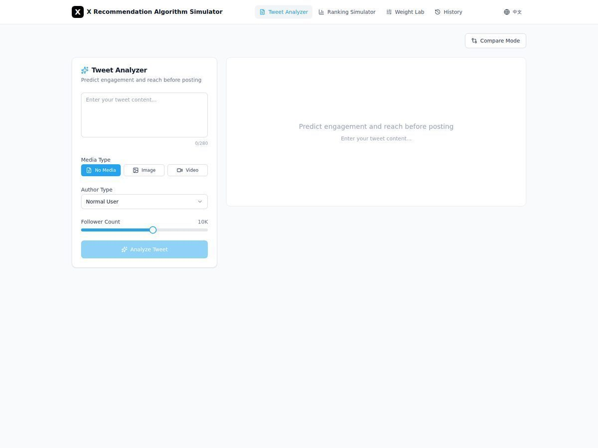
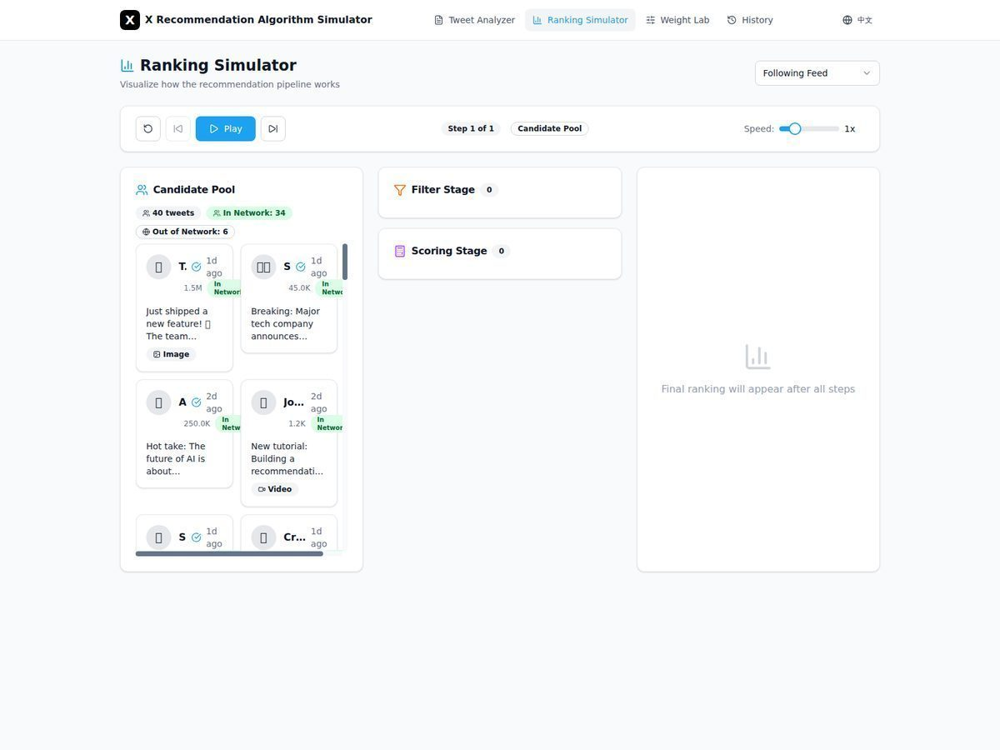

# X Algorithm Simulator

Interactive simulator for the public X recommendation pipeline.

用于理解 X 公开推荐流程的交互式模拟器。

Pinned to [`xai-org/x-algorithm@c65aa17`](https://github.com/xai-org/x-algorithm/tree/c65aa179db7bdd61e2c2821eac87f208a105c053) · [English](#english) · [简体中文](#简体中文)

## Interface Comparison / 界面对比

The current screenshots were regenerated from this version. / 当前截图由本版本重新生成。

<table>
  <tr>
    <th>Page / 页面</th>
    <th>Before / 之前</th>
    <th>Current / 当前</th>
  </tr>
  <tr>
    <td>Output Explorer<br>输出探索</td>
    <td></td>
    <td></td>
  </tr>
  <tr>
    <td>Ranking Simulator<br>排序模拟</td>
    <td></td>
    <td></td>
  </tr>
</table>

More screenshots: [`docs/screenshots`](docs/screenshots)

## English

### Project Description

Visualizes the public primary default path at upstream commit `c65aa17`. It uses deterministic local fixtures and cannot predict production reach or engagement.

### Features

- Step through the Scored Posts and For You pipelines.
- Explore 26 Phoenix outputs, ranking weights, filters, visibility, brand safety, and VMRanker DPP.
- Compare fixture outputs, tune weights, and keep local history in English or Chinese.

Production retrieval, models, social graph, safety services, and ads are not included. The public repository also omits `xai_post_text`, so local multilingual tokenization is not guaranteed to match production.

### Quick Start

Requires Node.js and npm.

```bash
git clone https://github.com/lingengyuan/x-algorithm-simulator.git
cd x-algorithm-simulator
npm install
npm run dev
```

### Skill Catalog

This is a web app, not a Codex skill package. Routes: `/`, `/simulator`, `/weights`, `/history`.

### Project Structure

Core references: [`upstreamSnapshot.ts`](src/data/upstreamSnapshot.ts), [`upstreamPolicyData.ts`](src/data/upstreamPolicyData.ts), [`pipeline.ts`](src/core/pipeline.ts), and [`upstreamParity.test.ts`](src/core/upstreamParity.test.ts).

### Configuration

No environment variables, credentials, or external services are required.

### Development and Testing

```bash
npm run check
```

Runs ESLint, Vitest, TypeScript, and the production build. The current parity suite and full bilingual screenshot flow have been verified.

### Contributing

Pin upstream changes and add a regression test for every behavior change.

### Maintenance Guide

Update the snapshot, implementation, tests, and screenshots together. Screenshot command: `node scripts/capture-screenshots.mjs` with the app running on port `4173`.

### License

[MIT](LICENSE)

## 简体中文

### 项目说明

可视化上游提交 `c65aa17` 公开的主默认路径。项目使用确定性本地测试数据，不能预测生产环境的真实曝光或互动。

### 功能特性

- 逐步查看 Scored Posts 和 For You 流程。
- 探索 26 个 Phoenix 输出、排序权重、过滤、可见性、品牌安全和 VMRanker DPP。
- 对比测试输出、实时调节权重，并保存中英文本地历史记录。

项目不包含生产召回、模型、社交图、安全服务和广告。公开仓库也没有 `xai_post_text`，因此本地多语言分词不保证与生产环境一致。

### 快速开始

需要 Node.js 和 npm。

```bash
git clone https://github.com/lingengyuan/x-algorithm-simulator.git
cd x-algorithm-simulator
npm install
npm run dev
```

### 技能目录

这是 Web 应用，不是 Codex Skill 包。页面入口为 `/`、`/simulator`、`/weights`、`/history`。

### 项目结构

核心文件：[`upstreamSnapshot.ts`](src/data/upstreamSnapshot.ts)、[`upstreamPolicyData.ts`](src/data/upstreamPolicyData.ts)、[`pipeline.ts`](src/core/pipeline.ts) 和 [`upstreamParity.test.ts`](src/core/upstreamParity.test.ts)。

### 配置

项目不需要环境变量、凭据或外部服务。

### 开发与测试

```bash
npm run check
```

该命令运行 ESLint、Vitest、TypeScript 和生产构建。当前一致性测试与中英文完整截图流程均已验证。

### 贡献指南

固定上游提交，并为每项行为变化添加回归测试。

### 维护指南

同步更新快照、实现、测试和截图。截图命令：应用在 `4173` 端口运行时执行 `node scripts/capture-screenshots.mjs`。

### 许可证

[MIT](LICENSE)
