# X Recommendation Algorithm Simulator / X 推荐算法模拟器

[English](#english) | [中文](#中文)

---

<a name="english"></a>

## English

An interactive web simulator for understanding the open-source parts of X's recommendation architecture. It is a **pipeline-level approximation**, not a production feed reproduction. The current version is aligned with the May 15, 2026 open-source `x-algorithm` update where the upstream code is public, and labels closed or service-backed parts as local approximations.

### Background

After deep-diving into the open-source code, we built this simulator to help everyone understand:

- **How candidates flow through stages** — Query Hydration → Sources → Pre-Selection Hydrators → Filters → Phoenix Scoring → RankingScorer → optional VMRanker Approximation → Selector → Post-Selection Hydrators/Filters → Scored Posts Side Effects → For You Blender → For You Side Effects
- **Where the two layers split** — Scored Posts ranking is separate from final For You timeline blending
- **How tweets are filtered** — 14 pre-scoring filters + 3 post-selection filters
- **How tweets are scored** — 20 local behavior predictions + 2 continuous dwell/click-dwell signals drive the simulated ranking, with Phoenix candidate isolation represented in the scorer details
- **How weights affect ranking** — Adjust parameters and see results in real-time

### Alignment with X Algorithm Update (May 15, 2026)

The upstream `xai-org/x-algorithm` repository added a larger For You feed implementation. Compared with the earlier version this simulator was based on, the major changes are:

| Area | Previous open-source flow | May 15, 2026 update | Simulator update |
|------|---------------------------|---------------------|------------------|
| Phoenix | Separate retrieval/ranker scripts and local score approximation | Single retrieval → ranking pipeline with exported artifacts | Analyzer and ranking scores now include quoted video view, not-dwelled, and click-dwell signals |
| User context | Basic action sequence and user features | Separate retrieval/scoring sequences, social graph, topics, starter packs, bloom history, demographics, IP, and gender context | Ranking Simulator now shows expanded query hydration stages |
| Candidate sources | Thunder + Phoenix retrieval | Thunder, TweetMixer, Phoenix, Phoenix Topics, Phoenix MoE, cached posts, plus For You modules such as ads, prompts, who-to-follow, and push-to-home | Post source names are represented with deterministic mock retrieval; final For You modules are blended as visible timeline items, with ads inserted through a local safe-gap approximation |
| Hydration | Core data, in-network, subscription, video duration, VF hints | Quote, media, language, blocked-by, filtered topics, brand safety, tweet metrics, following-replied users, mutual-follow similarity | Pre/post hydrator stages and candidate mock data now carry these signals |
| Filtering | 10 pre-scoring filters + 2 post-selection filters | Adds backup seen-history, video exclusion, topic filters, new-user topic filter, and ancillary VF | Filter list updated to 14 + 3 stages, with topic expansion and socialgraph edge cases modeled locally |
| Scoring | Phoenix → Weighted Sum → Author Diversity → OON Balance | PhoenixScorer → RankingScorer → optional VMRanker | Scoring keeps the same stage order; Phoenix now exposes candidate isolation, 60-minute age buckets, and 30-second continuous-value normalization as local feature metadata |
| Side effects | Mostly absent from the old simulator | Scored Posts cache/stats/reranking records and For You impression/served-history/response stats | Added visible side-effect checkpoints that preserve ranking output while showing downstream state updates |

### Screenshots (Interaction Evidence)

| Screenshot | Description |
|------------|-------------|
|  | After entering tweet text and clicking Analyze Tweet |
|  | After pressing Play and reaching the final blended timeline |
| 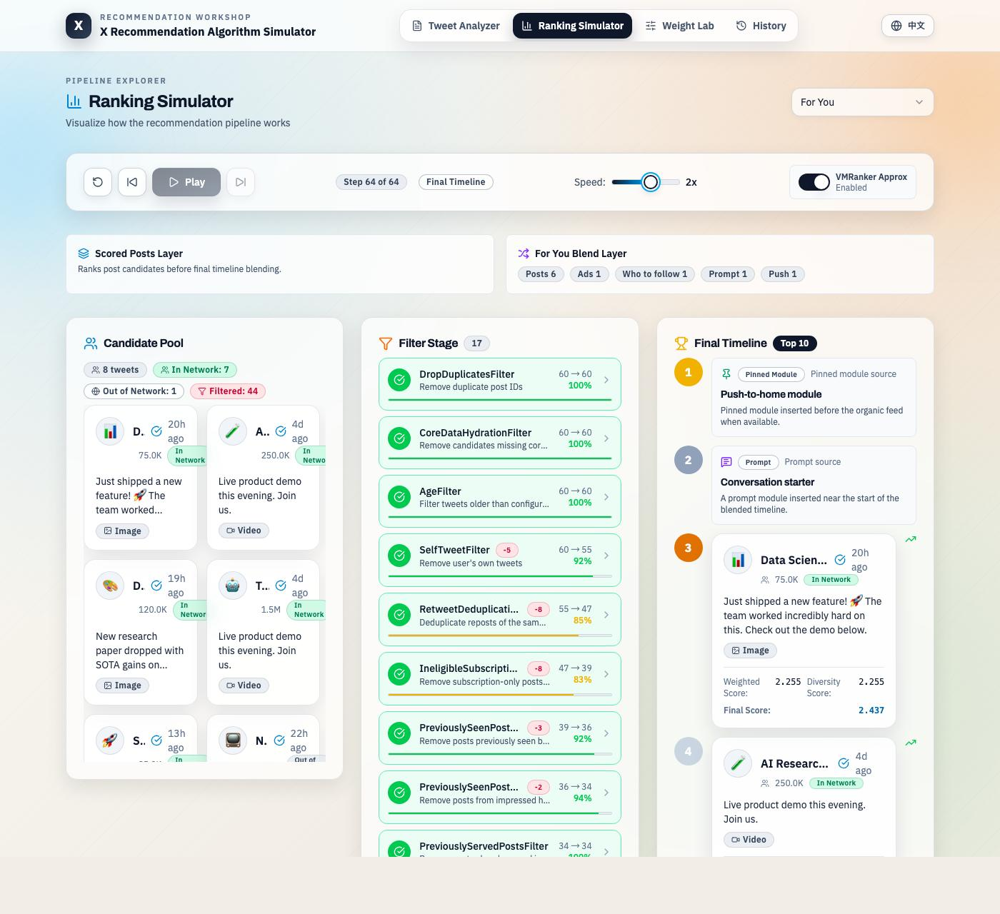 | After enabling VMRanker Approximation and reaching the 64-step final timeline |
| 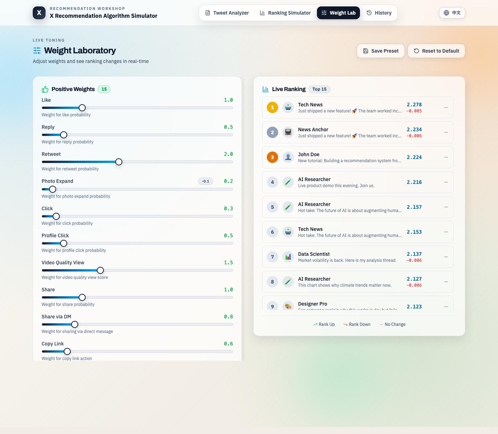 | After adjusting weights and observing ranking changes |
| 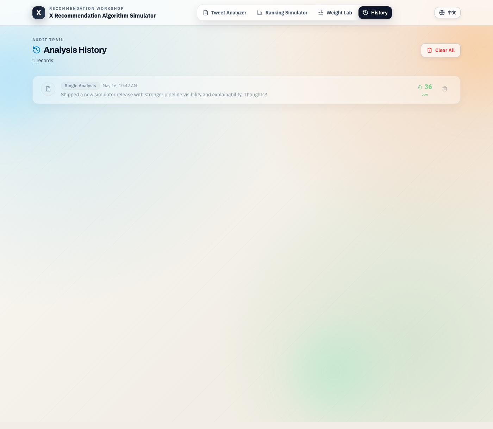 | History page populated by completed analysis runs |

#### Historical UI Comparison (2026-02-12)

These before/after screenshots show the February 2026 UI redesign. They are kept as project history and are not intended to describe the current May 2026 algorithm flow.

| Page | Before | Current |
|------|--------|---------|
| Tweet Analyzer |  |  |
| Ranking Simulator |  |  |
| Weight Laboratory | 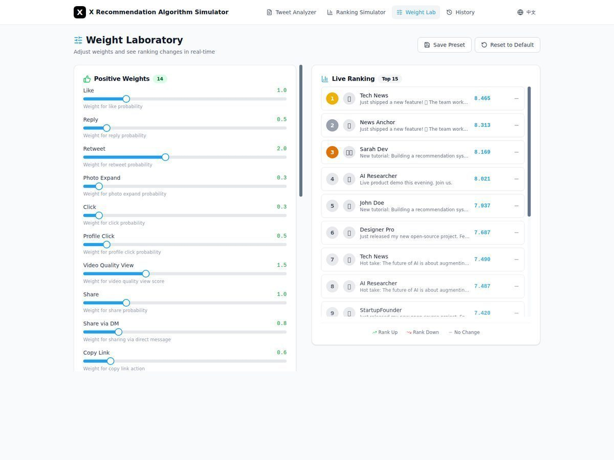 |  |
| History | 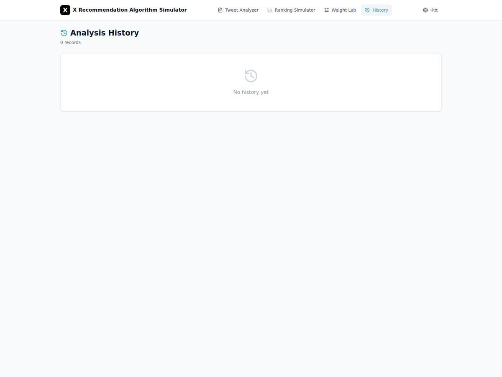 |  |

To regenerate all interaction screenshots:

```bash
npm run dev -- --host 127.0.0.1 --port 4173
node scripts/capture-screenshots.mjs
```

### Features

#### Tweet Analyzer
Analyze any tweet content and predict its performance:

- **20 Behavior Predictions** — Likes, retweets, replies, shares, follows, video views, quoted video views, not-dwelled risk, and more
- **Heat Score (0-100)** — Visual gauge showing tweet potential (Low/Medium/High/Viral)
- **Radar Chart** — Visualize 15 positive signals at a glance
- **Optimization Suggestions** — Local tips to improve the simulated score
- **Filter Risk Warnings** — Know if your tweet might be filtered out
- **Compare Mode** — Analyze multiple tweets side by side

#### Ranking Simulator
Watch the complete recommendation pipeline in action:

- **Updated Home Mixer Stages** — Expanded Query Hydrators, Sources, Candidate Hydrators, Pre-Filters, Phoenix, RankingScorer, optional VMRanker Approximation, Selector, Post-Filters, and For You blending
- **Two-Layer View** — Separates Scored Posts ranking from final For You timeline blending
- **Blended Timeline Items** — Shows posts, ads, who-to-follow, prompts, and push-to-home modules in the final feed
- **Safe-Gap Ad Placement** — Places ads in safe organic gaps and avoids posts carrying local brand-safety or visibility risk signals
- **17 Filter Stages** — 14 pre-scoring filters + 3 post-selection filters
- **2 Default Scoring Stages + 1 Optional Stage** — Phoenix Scorer (local approximation) → RankingScorer, with VMRanker Approximation available as an off-by-default control in the simulator and Weight Laboratory
- **Candidate Isolation Detail** — Phoenix scorer shows that candidates attend to user/history and themselves, not other candidates
- **Phoenix Feature Metadata** — Shows post-age buckets and continuous dwell normalization based on the public Phoenix model shape
- **Side-Effect Checkpoints** — Shows Scored Posts cache/stats/reranking records and For You served-history/impression updates
- **Step-by-Step Animation** — Play, pause, and control the pipeline execution
- **3 Scenarios** — Following Feed (in-network heavy), For You (balanced), Discovery Heavy (out-of-network heavy)
- **Detailed Statistics** — Input/output counts and tweet details at each stage

#### Weight Laboratory
Experiment with ranking parameters in real-time:

- **20+ Weight Sliders** — Adjust positive/negative signals plus topic/new-user OON and VM rerank controls
- **Live Updates** — See ranking changes instantly as you adjust
- **Diversity Controls** — Tune author diversity decay and floor values
- **OON Balance** — Control in-network vs out-of-network content ratio
- **Presets** — Save and load custom weight configurations

### Getting Started

```bash
# Clone the repository
git clone https://github.com/lingengyuan/x-algorithm-simulator.git

# Enter project directory
cd x-algorithm-simulator

# Install dependencies
npm install

# Start development server
npm run dev
```

After starting, open `http://localhost:5173` in your browser.

### Upstream Phoenix Baseline Verification

The simulator does not ship X's Phoenix artifacts. To verify the open-source baseline locally, use a separate checkout of `xai-org/x-algorithm` and install Git LFS first:

```bash
brew install git-lfs
git lfs install

cd ../x-algorithm
git pull --ff-only origin main

cd phoenix
uv sync
unzip -o artifacts/oss-phoenix-artifacts.zip -d artifacts/
uv run run_pipeline.py --artifacts_dir artifacts/oss-phoenix-artifacts --top_k_retrieval 50 --top_k_display 10
```

Local verification on 2026-05-16 used upstream commit `0bfc2795d308f90032544322747caacd535f75ae`. The Git LFS archive was 2.7 GB, extracted artifacts were 2.9 GB, and the full artifact directory was 5.7 GB. The Phoenix pipeline loaded the sports corpus, retrieved 50 candidates, ranked the top 10, and produced a valid final ranking. This confirms the simulator is being compared against the current open-source Phoenix release, while still remaining a local approximation.

### Tech Stack

| Category | Technology |
|----------|------------|
| Framework | React 19 + TypeScript |
| Styling | Tailwind CSS 4 |
| Charts | Recharts |
| Animation | Framer Motion |
| Routing | React Router 7 |
| i18n | i18next |
| Icons | Lucide React |
| Build | Vite 7 |

### Project Structure

```
src/
├── core/                    # Core algorithm implementation
│   ├── filters/             # 17 filter implementations
│   ├── scorers/             # 3 scorer implementations
│   ├── pipeline.ts          # Pipeline orchestration
│   └── types.ts             # TypeScript type definitions
├── components/
│   ├── Layout/              # App shell and navigation
│   ├── TweetAnalyzer/       # Tweet analysis module
│   ├── RankingSimulator/    # Ranking visualization
│   ├── WeightLab/           # Weight adjustment module
│   ├── History/             # Analysis history management
│   ├── shared/              # Shared UI components
│   └── ui/                  # Base UI primitives (shadcn/ui)
├── data/
│   ├── mockTweets.ts        # Mock tweet data and scenarios
│   └── defaultWeights.ts    # Default weight configuration
├── hooks/
│   └── useI18n.tsx          # Internationalization hook
├── utils/
│   ├── scoring.ts           # Phoenix score simulation
│   ├── snowflake.ts         # Snowflake ID utilities
│   └── storage.ts           # LocalStorage wrapper
└── App.tsx                  # Main app entry
```

### Algorithm Implementation

#### Filters (17 Stages)

| # | Filter | Description |
|---|--------|-------------|
| 1 | DropDuplicatesFilter | Remove duplicate tweet IDs |
| 2 | CoreDataHydrationFilter | Remove candidates missing required core fields |
| 3 | AgeFilter | Remove tweets older than configured threshold |
| 4 | SelfTweetFilter | Remove user's own tweets |
| 5 | RetweetDeduplicationFilter | Deduplicate reposts of the same original tweet |
| 6 | IneligibleSubscriptionFilter | Remove subscription-only tweets user cannot access |
| 7 | PreviouslySeenPostsFilter | Remove tweets seen by client/bloom history |
| 8 | PreviouslySeenPostsBackupFilter | Remove tweets found in impressed-history backup |
| 9 | PreviouslyServedPostsFilter | Remove tweets already served in session (bottom requests) |
| 10 | MutedKeywordFilter | Remove tweets matching muted keywords |
| 11 | AuthorSocialgraphFilter | Remove blocked/muted authors and authors blocking the viewer |
| 12 | VideoFilter | Remove videos when the request excludes video content |
| 13 | TopicIdsFilter | Keep requested topics and remove excluded topics |
| 14 | NewUserTopicIdsFilter | Keep new-user OON content tied to inferred topics |
| 15 | VFFilter | Post-selection visibility filtering |
| 16 | AncillaryVFFilter | Drop ancillary posts marked by VF/brand-safety signals |
| 17 | DedupConversationFilter | Keep highest-scored candidate per conversation |

#### Scorers (3 Stages)

| # | Scorer | Input | Output |
|---|--------|-------|--------|
| 1 | Phoenix Scorer | Tweet content, metadata, retrieval/scoring history | Behavior probabilities and continuous engagement values |
| 2 | RankingScorer | Phoenix outputs + weights + context | Weighted score, author diversity adjustment, and OON balance |
| 3 | VMRanker Approximation (optional) | Ranking score + hydrated candidate features | Locally approximated reranked score when explicitly enabled |

#### 20 Predicted Behaviors

**Positive Signals (15):**
- Favorite (Like), Reply, Retweet, Quote
- Photo Expand, Click, Profile Click
- Video Quality View, Share, Share via DM, Share via Copy Link
- Dwell, Quoted Click, Quoted Video Quality View, Follow Author

**Negative Signals (5):**
- Not Interested, Block Author, Mute Author, Report, Not Dwelled

**Continuous Signals (2):**
- Dwell Time, Click Dwell Time

#### Phoenix Candidate Isolation

The open-source Phoenix model uses an attention mask where candidates can attend to user/history tokens and to themselves, but not to other candidates. The simulator represents this as scorer metadata so the ranking step does not imply that candidates influence each other's Phoenix prediction.

#### Phoenix Feature Metadata

The public Phoenix ranking model buckets post age with 60-minute granularity up to 4,800 minutes, then uses an overflow bucket. It also normalizes continuous dwell-style values to a 0-1 range with a 30-second scale. The simulator exposes these local feature values in the Phoenix scorer details.

#### For You Safe-Gap Ads

The upstream For You layer uses dedicated blending and spacing logic for ads and other modules. The simulator now models that behavior locally by finding safe organic gaps inside the ranked-post list before other modules are added, and by avoiding adjacent posts with brand-safety, visibility, or safety-label risk signals. This still does not reproduce production ad selection, auction behavior, multi-ad controls, keyword/account avoidance, or the full upstream spacing rules.

#### Side-Effect Checkpoints

The upstream Home Mixer records downstream state after ranking and blending. The simulator now exposes local, read-only checkpoints for Scored Posts cache/stat/reranking records and For You impression, served-history, response-stat, and history-truncation updates. These steps do not change ranking scores; they show the state updates that happen around the response.

### Fidelity and Limits

This project intentionally simulates architecture and control flow, not online production behavior.

- **Covered with high confidence:** pipeline stage order, filter/scorer ordering, pre/post filtering separation, Phoenix candidate isolation shape, Phoenix age-bucket and continuous-normalization metadata, the split between Scored Posts and For You blending, visible For You module insertion, safe-gap ad avoidance against local risk signals, side-effect checkpoints, and the presence of the 14 + 3 filter stages.
- **Approximated locally:** retrieval outputs, Phoenix predictions, Grox-derived content signals, user features/query hydration, VF decisions, ads/prompts/who-to-follow blending positions, ad safe-gap scoring, VMRanker behavior, score normalization, and service-backed hydration.
- **Unavailable in open source:** production candidate pools, online feature stores, internal `params` values, service clients, VMRanker internals, and live safety/anti-abuse systems; therefore exact timeline results cannot be reproduced 1:1.

### Current Fidelity Score (2026-05-16)

Final independent Phase 7 review: **86/100**. The simulator now meets the 80+ target as an honest flow-level approximation of the public X algorithm, not as a 1:1 production feed reproduction.

| Area | Status | Notes |
|------|--------|-------|
| Pipeline structure | Strong | The simulator now separates Scored Posts ranking from final For You blending. |
| Filter coverage | Good | The 14 + 3 filter stages are present, with improved topic expansion and socialgraph checks. |
| Scoring structure | Medium+ | RankingScorer shape is closer; Phoenix feature metadata is visible; VMRanker is now represented as an off-by-default optional approximation. |
| Final feed blending | Medium+ | Ads, prompts, who-to-follow, and push-to-home are represented; side effects and local ad safe-gap avoidance are visible, but positions remain deterministic approximations. |
| Production fidelity | Limited | Exact X results require closed data, services, parameters, and online models. |

### What Can Be Fixed vs. What Cannot Be Fully Reproduced

- **Fixable in this simulator:** stage ordering, filter composition and execution order, scorer combination logic, topic/new-user filtering behavior, diversity/OON balancing behavior, deterministic mock data scenarios, and UX-level observability of each pipeline step.
- **Not fully reproducible with open-source only:** online retrieval quality, production feature stores/service outputs, Grox service outputs, Phoenix model serving details, internal thresholds/normalization in closed `params`, VMRanker internals, and live anti-abuse/visibility systems.

### Verification Status (2026-05-16)

- `npm run lint` passed
- `npm run build` passed
- `node scripts/check-phoenix-feature-metadata.mjs` passed
- `node scripts/capture-screenshots.mjs` passed on local Chrome, including final timeline module checks, hidden internal source labels, and the optional VMRanker 64-step final flow
- Upstream Phoenix baseline ran successfully from Git LFS artifacts in `xai-org/x-algorithm`
- Browser verification covered analyzer input/results, simulator playback to final blended timeline, Phoenix scorer metadata, required For You modules (push-to-home, ads, who-to-follow, prompts), VMRanker toggle behavior, weight changes, and history rendering

### Language Support

- English
- 中文 (Chinese)

Toggle with the globe icon in the header.

### Related Links

- [X Algorithm Open Source](https://github.com/xai-org/x-algorithm)

### License

MIT

### Current Architecture Flow
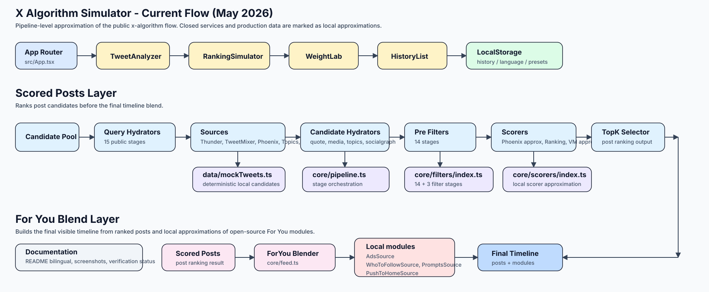
---

<a name="中文"></a>

## 中文

一个交互式 Web 模拟器，用来理解 X 已开源部分的推荐架构。本项目是**流程级近似模拟**，不是线上首页复现。当前版本对齐 2026-05-15 开源的新版 `x-algorithm`；凡是依赖未开源模型、服务或生产数据的部分，都会按本地近似模拟处理。

### 项目背景

在深度阅读开源源码后，我们构建了这个模拟器，帮助大家理解：

- **候选内容如何流转** — Query Hydration → Sources → Pre-Selection Hydrators → Filters → Phoenix Scoring → RankingScorer → 可选 VMRanker 近似模拟 → Selector → Post-Selection Hydrators/Filters → Scored Posts 副作用 → For You Blender → For You 副作用
- **两层流程如何分开** — Scored Posts 帖子排序层和最终 For You 首页混排层是两件事
- **推文如何被过滤** — 14 个前置过滤器 + 3 个后置过滤器
- **推文如何被评分** — 20 种本地行为预测 + 2 个连续停留/点击后停留信号驱动模拟排序，并在评分细节中展示 Phoenix 候选隔离规则
- **权重如何影响排名** — 实时调整参数并查看效果

### 与 X 新版算法同步（2026-05-15）

上游 `xai-org/x-algorithm` 新增了更完整的 For You 推荐实现。相比本项目最初参考的旧版流程，主要变化如下：

| 领域 | 旧版开源流程 | 2026-05-15 新版 | 模拟器同步内容 |
|------|--------------|-----------------|----------------|
| Phoenix | 分开的召回/排序脚本，本地近似打分 | 单入口 retrieval → ranking 推理流程，并提供导出的模型素材 | 分析器和排序分数新增引用视频观看、未停留、点击后停留信号 |
| 用户上下文 | 基础行为序列和用户特征 | 区分召回/排序序列，并加入社交关系、话题、starter pack、曝光历史、画像、IP、性别等上下文 | 排序模拟器新增扩展后的 Query Hydration 阶段 |
| 候选来源 | Thunder + Phoenix retrieval | Thunder、TweetMixer、Phoenix、Phoenix Topics、Phoenix MoE、缓存内容，以及广告、推荐关注、交互提示、置顶回流等 For You 模块 | 用确定性的 mock 召回展示新版帖子来源，并在最终首页流中展示 For You 模块；广告会通过本地安全间隔近似插入 |
| 候选补全 | 核心数据、内外网、订阅、视频时长、可见性提示 | 新增引用内容、媒体、语言、被作者屏蔽、过滤话题、品牌安全、互动计数、关注用户回复、共同关注相似度 | 前后置补全阶段和 mock 数据同步携带这些信号 |
| 过滤 | 10 个前置过滤器 + 2 个后置过滤器 | 新增备用已看历史、视频排除、话题过滤、新用户话题过滤、附属内容可见性过滤 | 过滤器列表更新为 14 + 3，并补充话题展开和社交关系边界情况 |
| 评分 | Phoenix → 加权求和 → 作者多样性 → 内外网平衡 | PhoenixScorer → RankingScorer → 可选 VMRanker | 保留新版三段顺序；Phoenix 评分阶段新增候选隔离、60 分钟年龄桶、30 秒连续值归一化等本地特征元数据 |
| 副作用 | 旧版模拟器基本没有展示 | Scored Posts 缓存/统计/重排记录，以及 For You 曝光、已服务历史、响应统计 | 新增可见的只读副作用检查点，不改变排序结果，只展示响应前后的状态更新 |

### 效果截图（交互证据）

| 截图 | 说明 |
|------|------|
| 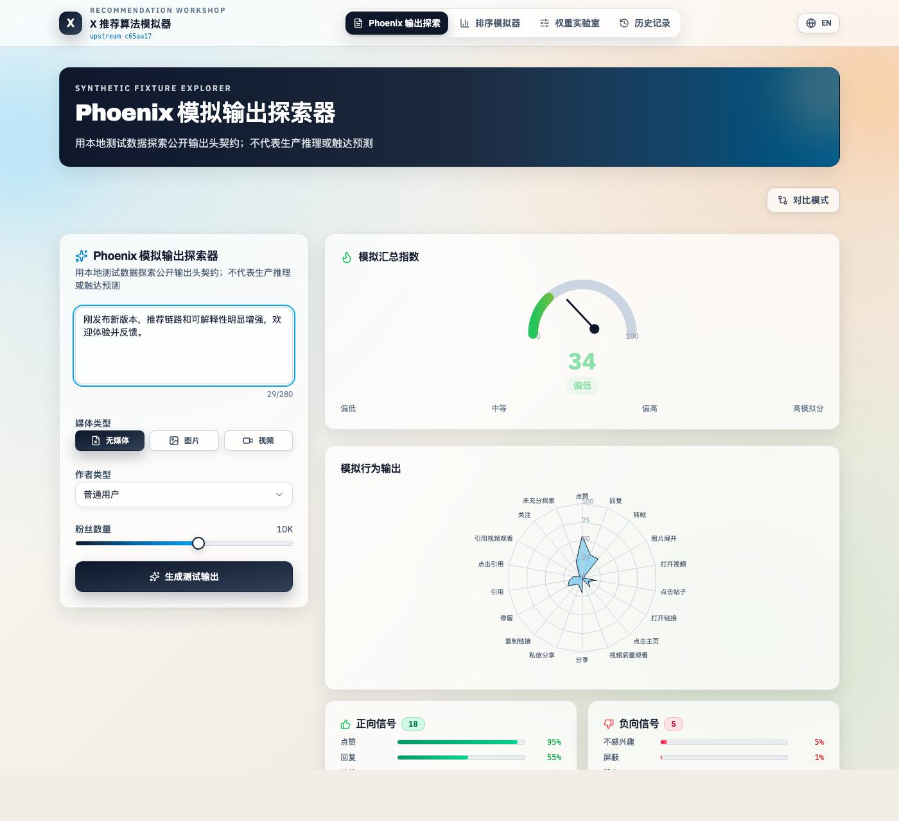 | 输入内容并点击“分析推文”后，展示评分与图表 |
| 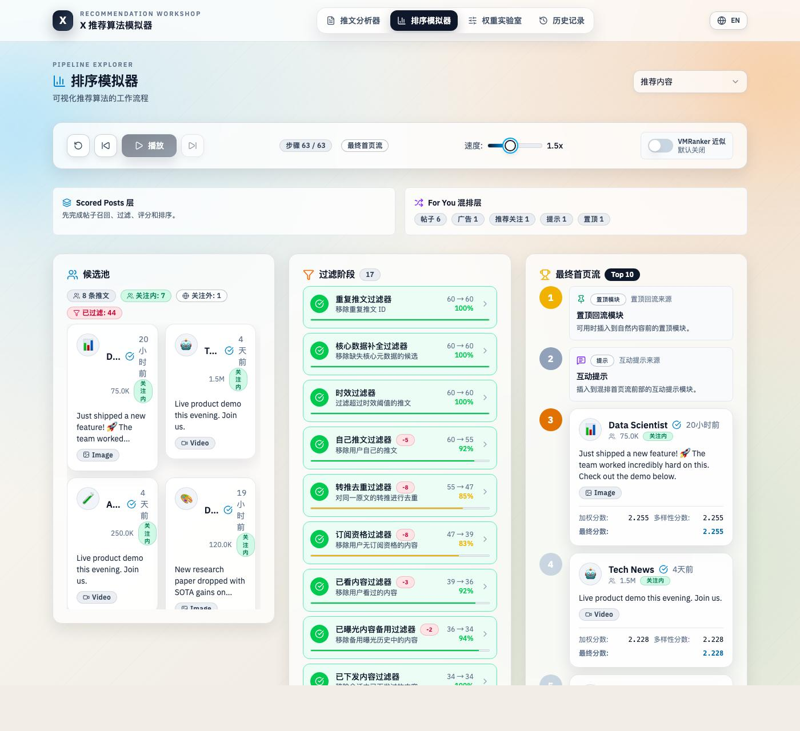 | 点击“播放”并运行到最终混排首页流 |
| 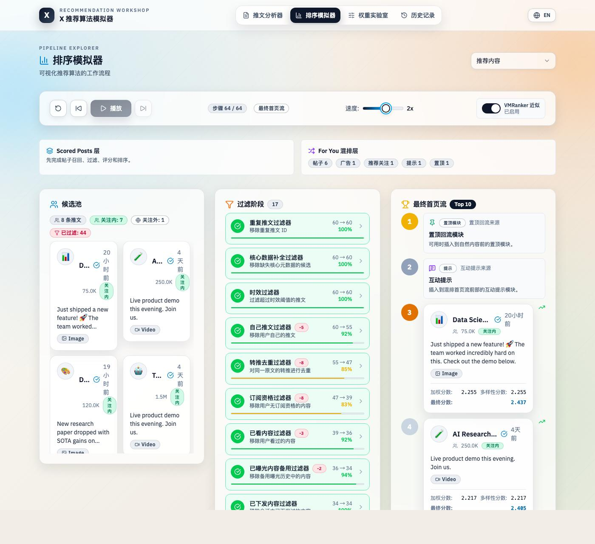 | 开启 VMRanker 近似模拟后，运行到 64 步最终首页流 |
| 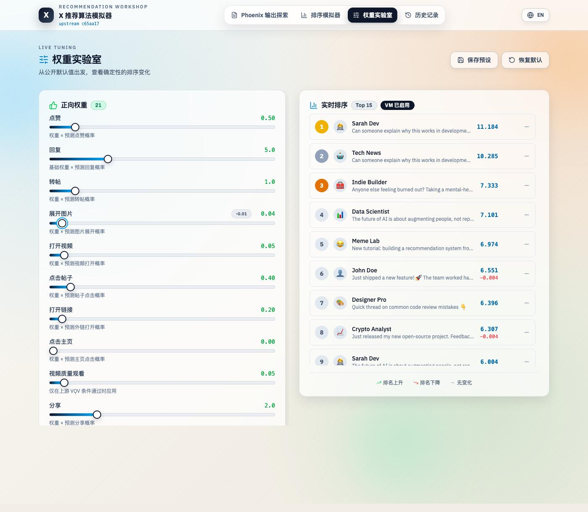 | 调整滑块后实时排名变化 |
| 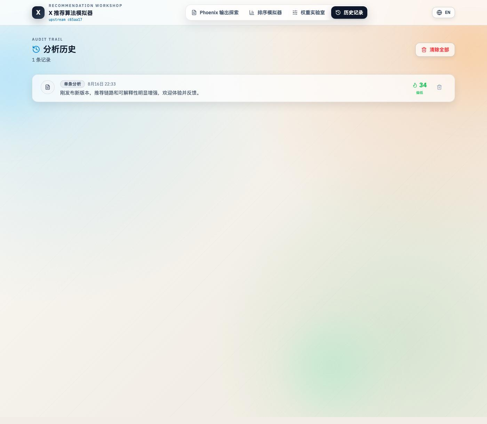 | 分析执行后历史记录页出现条目 |

#### 历史 UI 对比（2026-02-12）

下面的前后对比用于保留 2026 年 2 月 UI 重设计的项目历史，不代表当前 2026 年 5 月算法流程。

| 页面 | 重设计前 | 当前版本 |
|------|----------|----------|
| 推文分析器 | 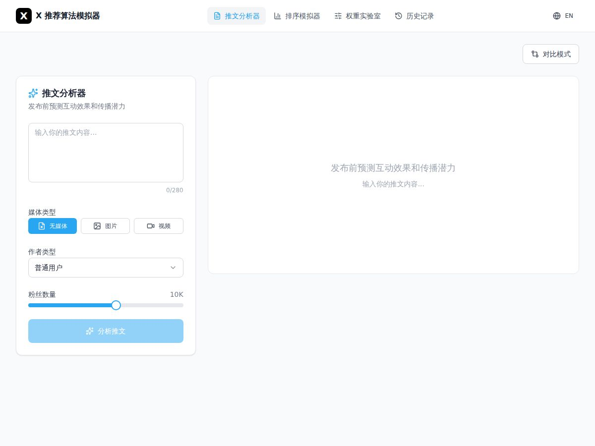 |  |
| 排序模拟器 | 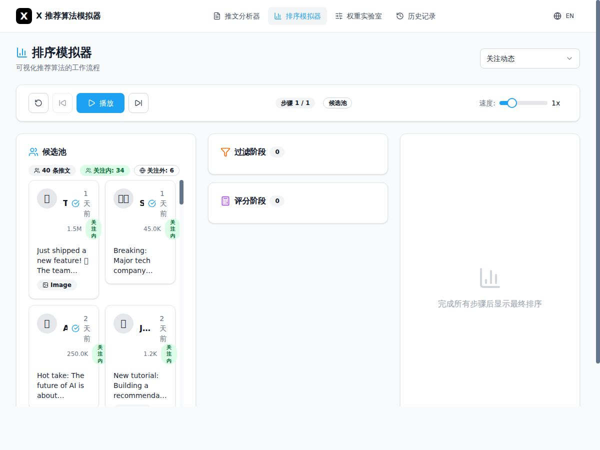 |  |
| 权重实验室 | 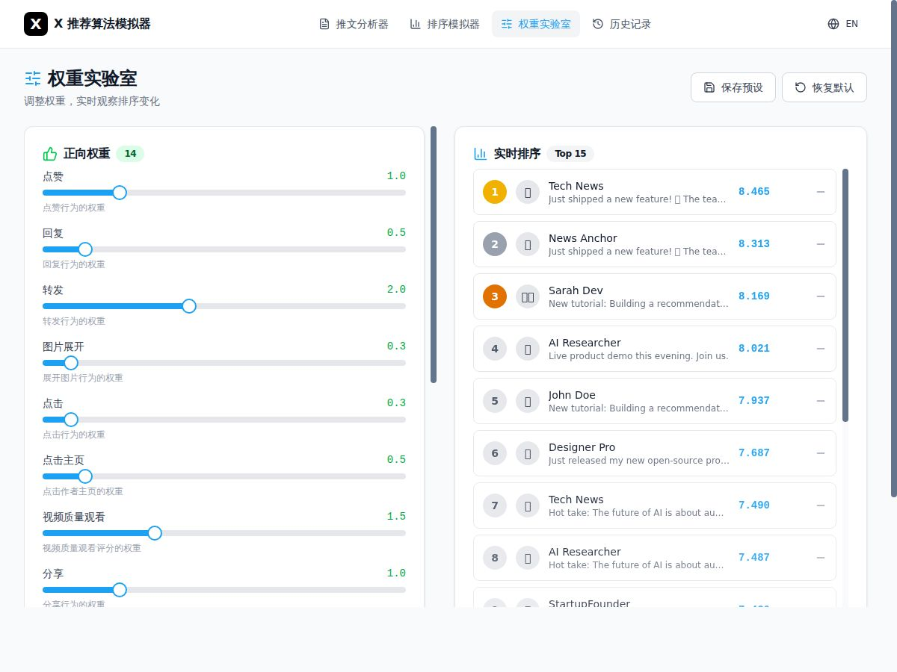 |  |
| 历史记录 | 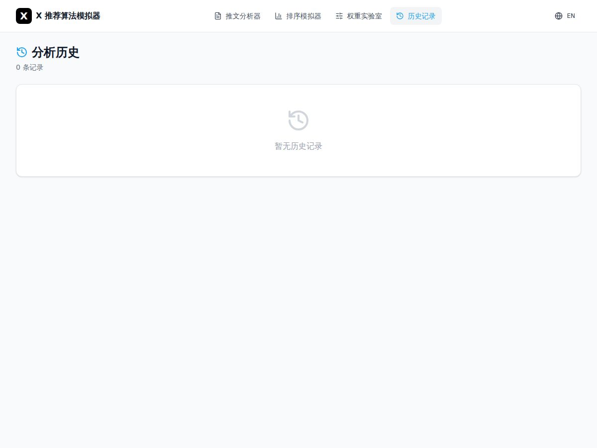 |  |

重新生成交互截图可执行：

```bash
npm run dev -- --host 127.0.0.1 --port 4173
node scripts/capture-screenshots.mjs
```

### 功能特性

#### 推文分析器

分析任意推文内容，预测其表现：

- **20 种行为预测** — 点赞、转发、回复、分享、关注、视频观看、引用视频观看、未停留风险等
- **热度评分 (0-100)** — 可视化仪表盘展示推文潜力（低/中/高/爆款）
- **雷达图** — 一眼看清 15 种正向信号分布
- **优化建议** — 基于本地模拟分数的改进提示
- **过滤风险预警** — 提前知道推文是否可能被过滤
- **对比模式** — 多条推文并排分析

#### 排序模拟器

观看完整的推荐管道运行过程：

- **新版 Home Mixer 阶段** — 扩展 Query Hydrator、Source、Candidate Hydrator、前置过滤、Phoenix、RankingScorer、可选 VMRanker 近似模拟、选择器、后置过滤和 For You 混排
- **两层视图** — 区分 Scored Posts 帖子排序层和最终 For You 首页混排层
- **混排首页元素** — 最终结果展示帖子、广告、推荐关注、交互提示、置顶回流模块
- **广告安全间隔** — 广告会放在较安全的自然内容间隔中，避开带有品牌安全、可见性或安全标签风险的帖子
- **17 个过滤阶段** — 14 个前置过滤器 + 3 个后置过滤器
- **默认 2 个评分阶段 + 1 个可选阶段** — Phoenix Scorer（本地近似）→ RankingScorer；VMRanker 近似模拟默认关闭，可在排序模拟器和权重实验室中手动开启
- **候选隔离细节** — Phoenix 评分阶段展示候选只看用户/历史和自身，不看其他候选
- **Phoenix 特征元数据** — 展示基于公开 Phoenix 模型形态的帖子年龄桶和连续停留值归一化
- **副作用检查点** — 展示 Scored Posts 缓存/统计/重排记录，以及 For You 已服务历史和曝光更新
- **逐步动画** — 播放、暂停、控制管道执行
- **3 种场景** — 关注动态（内网为主）、推荐（内外网平衡）、探索型推荐（外网占比更高）
- **详细统计** — 每个阶段的输入输出数量和推文详情

#### 权重实验室

实时试验排序参数：

- **20+ 权重滑块** — 调整正负向信号、话题/新用户关注外权重和 VM 重排强度
- **实时更新** — 调整参数立即看到排序变化
- **多样性控制** — 调节作者多样性衰减和下限
- **内外网平衡** — 控制关注内容与推荐内容的比例
- **预设保存** — 保存和加载自定义权重配置

### 快速开始

```bash
# 克隆仓库
git clone https://github.com/lingengyuan/x-algorithm-simulator.git

# 进入项目目录
cd x-algorithm-simulator

# 安装依赖
npm install

# 启动开发服务器
npm run dev
```

启动后，在浏览器打开 `http://localhost:5173` 即可使用。

### 上游 Phoenix 基线验证

本模拟器不会自带 X 的 Phoenix 模型素材。要验证当前开源基线，需要在单独的 `xai-org/x-algorithm` 仓库中先安装 Git LFS，并拉取上游素材：

```bash
brew install git-lfs
git lfs install

cd ../x-algorithm
git pull --ff-only origin main

cd phoenix
uv sync
unzip -o artifacts/oss-phoenix-artifacts.zip -d artifacts/
uv run run_pipeline.py --artifacts_dir artifacts/oss-phoenix-artifacts --top_k_retrieval 50 --top_k_display 10
```

2026-05-16 的本地验证使用上游提交 `0bfc2795d308f90032544322747caacd535f75ae`。Git LFS 压缩包大小为 2.7 GB，解压后的模型素材为 2.9 GB，完整素材目录为 5.7 GB。Phoenix pipeline 已能加载 sports corpus、召回 50 条候选、排序 Top 10，并输出有效最终排名。这说明本项目的对比基线已经补齐到当前开源 Phoenix 版本；但模拟器仍然只是本地近似，不是线上结果复现。

### 技术栈

| 类别 | 技术 |
|------|------|
| 框架 | React 19 + TypeScript |
| 样式 | Tailwind CSS 4 |
| 图表 | Recharts |
| 动画 | Framer Motion |
| 路由 | React Router 7 |
| 国际化 | i18next |
| 图标 | Lucide React |
| 构建 | Vite 7 |

### 项目结构

```
src/
├── core/                    # 核心算法实现
│   ├── filters/             # 17 个过滤器实现
│   ├── scorers/             # 3 个评分器实现
│   ├── pipeline.ts          # 管道编排
│   └── types.ts             # TypeScript 类型定义
├── components/
│   ├── Layout/              # 应用框架和导航
│   ├── TweetAnalyzer/       # 推文分析模块
│   ├── RankingSimulator/    # 排序可视化
│   ├── WeightLab/           # 权重调整模块
│   ├── History/             # 历史记录管理
│   ├── shared/              # 共享 UI 组件
│   └── ui/                  # 基础 UI 原语 (shadcn/ui)
├── data/
│   ├── mockTweets.ts        # 模拟推文数据和场景
│   └── defaultWeights.ts    # 默认权重配置
├── hooks/
│   └── useI18n.tsx          # 国际化 Hook
├── utils/
│   ├── scoring.ts           # Phoenix 评分模拟
│   ├── snowflake.ts         # Snowflake ID 工具
│   └── storage.ts           # LocalStorage 封装
└── App.tsx                  # 主应用入口
```

### 算法实现

#### 过滤器（17 个阶段）

| # | 过滤器 | 说明 |
|---|--------|------|
| 1 | DropDuplicatesFilter | 移除重复推文 ID |
| 2 | CoreDataHydrationFilter | 过滤缺少核心字段的候选 |
| 3 | AgeFilter | 按时效阈值过滤旧推文 |
| 4 | SelfTweetFilter | 移除用户自己的推文 |
| 5 | RetweetDeduplicationFilter | 对同一原文转推进行去重 |
| 6 | IneligibleSubscriptionFilter | 移除用户无订阅资格内容 |
| 7 | PreviouslySeenPostsFilter | 基于 seen/bloom 历史过滤已看内容 |
| 8 | PreviouslySeenPostsBackupFilter | 移除备用曝光历史中的内容 |
| 9 | PreviouslyServedPostsFilter | 在 bottom request 中过滤已下发内容 |
| 10 | MutedKeywordFilter | 过滤命中静音关键词的推文 |
| 11 | AuthorSocialgraphFilter | 过滤被屏蔽/静音作者，以及屏蔽当前用户的作者 |
| 12 | VideoFilter | 请求排除视频时移除视频内容 |
| 13 | TopicIdsFilter | 保留请求话题并移除排除话题 |
| 14 | NewUserTopicIdsFilter | 新用户场景保留匹配推断话题的关注外内容 |
| 15 | VFFilter | 后置可见性过滤 |
| 16 | AncillaryVFFilter | 移除可见性/品牌安全标记的附属内容 |
| 17 | DedupConversationFilter | 每个对话仅保留最高分候选 |

#### 评分器（3 个阶段）

| # | 评分器 | 输入 | 输出 |
|---|--------|------|------|
| 1 | Phoenix Scorer | 推文内容、元数据、召回/排序历史 | 行为概率和连续互动值 |
| 2 | RankingScorer | Phoenix 输出 + 权重 + 场景上下文 | 加权分数、作者多样性调整、关注外平衡 |
| 3 | VMRanker 近似模拟（可选） | 排序分数 + 候选补全特征 | 手动开启后输出本地近似重排分数 |

#### 20 种预测行为

**正向信号（15 种）：**
- 点赞、回复、转发、引用
- 展开图片、点击、点击头像
- 看完视频、分享、私信分享、复制链接
- 停留、点击引用、引用视频观看、关注作者

**负向信号（5 种）：**
- 不感兴趣、屏蔽作者、静音作者、举报、未停留

**连续信号（2 种）：**
- 停留时长、点击后停留时长

#### Phoenix 候选隔离

开源 Phoenix 模型使用注意力掩码：候选可以看用户和历史行为，也可以看自己，但不能看其他候选。模拟器已把这个规则作为评分阶段元数据展示，避免让人误以为候选之间会互相影响 Phoenix 预测。

#### Phoenix 特征元数据

公开 Phoenix 排序模型会按 60 分钟粒度计算帖子年龄桶，上限为 4,800 分钟，超过后进入溢出桶；连续停留类值会按 30 秒尺度归一化到 0-1。模拟器已在 Phoenix 评分细节里展示这些本地特征值。

#### For You 广告安全间隔

上游 For You 层对广告和其他模块有专门的混排与间隔逻辑。模拟器现在用本地方式近似这部分：先在已排序帖子列表里寻找适合插入广告的自然内容间隔，再加入其他模块，并避开相邻的品牌安全、可见性或安全标签风险帖子。这仍然不复现真实广告选择、广告竞价、多广告控制、关键词/账号避让，也不是上游完整间隔规则。

#### 副作用检查点

上游 Home Mixer 在排序和混排后会记录后续状态。模拟器现在加入本地只读检查点，展示 Scored Posts 缓存、统计、重排记录，以及 For You 曝光、已服务历史、响应统计和历史裁剪更新。这些步骤不改变排名分数，只展示响应前后的状态变化。

### 模拟精度与边界

本项目刻意做“架构与流程模拟”，而不是线上效果复现：

- **较高把握覆盖**：阶段顺序、过滤器/评分器顺序、前后置过滤分层、Phoenix 候选隔离形态、Phoenix 年龄桶和连续值归一化元数据、Scored Posts 与 For You 混排分层、最终首页模块插入、广告对本地风险信号的安全间隔避让、副作用检查点，以及 14 + 3 个过滤阶段。
- **本地近似实现**：召回结果、Phoenix 预测、Grox 内容理解信号、用户特征补全、可见性决策、广告/交互提示/推荐关注插入位置、广告安全间隔评分、VMRanker 行为、分数归一化和服务依赖补全。
- **开源不可得（无法 1:1）**：生产候选池、线上特征服务、内部 `params`、服务客户端、VMRanker 内部实现，以及实时安全/反滥用系统；因此无法复现真实 X 首页结果。

### 当前模拟精度评分（2026-05-16）

最终独立 Phase 7 评分：**86/100**。作为对 X 开源算法的流程级近似模拟，当前版本已经达到 80+ 目标；它仍然不是线上首页 1:1 复现。

| 维度 | 状态 | 说明 |
|------|------|------|
| 流程结构 | 较强 | 已区分 Scored Posts 帖子排序层和最终 For You 混排层。 |
| 过滤覆盖 | 较好 | 14 + 3 个过滤阶段已覆盖，并补充话题展开和社交关系检查。 |
| 评分结构 | 中等+ | RankingScorer 更接近上游结构；Phoenix 特征元数据已可见；VMRanker 已改为默认关闭的可选近似阶段。 |
| 最终混排 | 中等+ | 已展示广告、交互提示、推荐关注、置顶回流、副作用检查点和本地广告安全间隔避让，但插入位置仍是确定性近似。 |
| 生产一致性 | 有限 | 精确结果依赖未开源数据、服务、参数和线上模型。 |

### 哪些可以修复，哪些无法完全复现

- **可在模拟器中持续修复/改进：** 阶段顺序、过滤器组合与执行顺序、评分器组合逻辑、话题/新用户过滤行为、多样性与内外网平衡策略、可控 mock 场景，以及各阶段可视化可观测性。
- **仅靠开源代码无法 1:1：** 线上召回质量、生产特征服务输出、Grox 服务输出、Phoenix 模型在线服务细节、闭源 `params` 中的真实阈值与归一化、VMRanker 内部实现、实时反滥用/可见性系统。

### 当前验证状态（2026-05-16）

- `npm run lint` 已通过
- `npm run build` 已通过
- `node scripts/check-phoenix-feature-metadata.mjs` 已通过
- `node scripts/capture-screenshots.mjs` 已在本地 Chrome 通过，并验证最终首页模块、内部来源名不外露，以及可选 VMRanker 的 64 步最终流
- 上游 Phoenix 基线已通过 Git LFS 模型素材完成真实运行验证
- 浏览器验证覆盖：分析器输入和结果、排序模拟器播放到最终混排首页流、Phoenix 评分元数据、必要 For You 模块（置顶回流、广告、推荐关注、交互提示）、VMRanker 开关效果、权重调整和历史记录渲染

### 语言支持

- English（英文）
- 中文

点击顶部导航栏的地球图标切换语言。

### 相关链接

- [X 算法开源仓库](https://github.com/xai-org/x-algorithm)

### 开源协议

MIT

### 最新架构流程图

